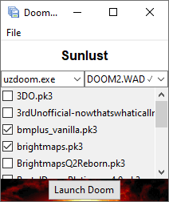

It can run Doom! But can it run the launcher?

A small, simple Doom mod launcher written in Python with minimal dependencies.

Some features:

- Easy configuration
- Reads WADs from folders, you don't have to add them manually one-by-one
- Inspects map packs for titles, thumbnails, and what IWAD to use
- Groups IWADs with levelset PWADs as "map sets"
- Separates gameplay mods from map packs
- Keeps your saves separate for each map pack
- Runs on pretty much any computer with a full Python environment, including on Linux
